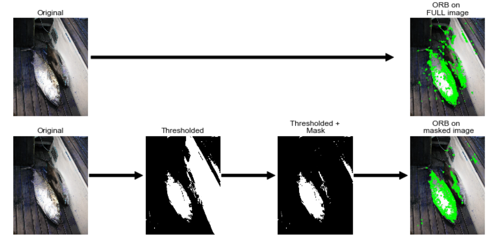

% A fish tale into data science (I)
 
# The starting point
In this blog post and the following one, we will relate our experience in a competition of image classification. In this first post, we will lay out elements about how to start a competition with a basic method and how we subsequently structured our approach in a project management perspective. In the second post, we will then elaborate on the major approach we tried in the time frame we had. 
 
We took a kaggle competition as a trial project to help us acquire an experience in real world data issues without too much hassle on cleaning and getting the data. The objective of this competition is to contribute to fisheries monitoring by finding the best algorithm classifying into seven species pictures caught from fishing boats. For more details about the rules, please refer to [kaggle website](https://www.kaggle.com/c/the-nature-conservancy-fisheries-monitoring).
 
## Where do we come from?
We are two freshly recruited data scientists with know hows about: coding, statistics and the constraints of real life data projects. Both of us have an affinity with unix environments, experience in the python programming language and bash scripting for automation purposes. We both have a PhD in quantitative disciplines (physical chemistry and computational biology) obtained after carrying  out our own research project with autonomy and perseverance.
 
## What is the scope of the experience for us?
Data science can have rather broad definitions. In our view, it is a job in which someone handles a data oriented project in its entirety. It should comprise the overlapping of three distinct domains: the skills of a statistician who knows how to model and summarize datasets; the skills of a computer scientist who can design and use algorithms to efficiently store, process, and visualize the data; and a field specific expertise that enables to ask the right questions and put the answers in perspective. The most common tasks of a data scientist include project conception, tidying and exploring raw data, developing meaningful analysis, extract knowledge and information to then communicate a business oriented solution. This definition is further modulated by the type of company you are working for/with as illustrated [here](http://blog.udacity.com/2014/11/data-science-job-skills.html), linking required skillsets to the depth of data culture in the organization.
 
With this mindset, our objective was not limited to get high rankings in this image classification competition but also to expand our training in a data driven project.

## The competition constrains, dataset and results assessment
The [NDA](https://kaggle2.blob.core.windows.net/competitions/kaggle/5568/media/Competition%20Governing%20NDA%20110816.pdf) prevents us from sharing the competition pictures. This is why we won’t show pictures of the data in this post. The training dataset is divided in eight categories: six fish species and two extra classes: no fish and other (whales, ...). The classes are not equally represented as shown in the figure below. The pictures are wide field shots from several boats encompassing variations such as: day/night, multiplicity of fishes per picture and large fields of boat features.
 
<embed type="image/svg+xml" src="img/Distribution.svg" />

Figure 1. Fish species proportions in the training dataset (3777 images).
 
Beyond this generic description, we also noticed elements that reflect pictures quality and shooting conditions. For instance, the pictures are taken from movie cameras on boats, this means that some shots are actually successive images from one scene. Quite a few fishes were also partially hidden behind fishermen legs or boat elements. We then noticed different fish characteristics : the sharks have fins with very characteristic shapes, Yellowfin tuna have colored fins (yes, yellow) and so on for all of them. An exception is made for Albacore and Big eye tunas that have very little difference. The length of their side fins seems to vary (thank you [wikipedia](https://en.wikipedia.org/wiki/Yellowfin_tuna)) but when we looked at the pictures we had, this was not something really visible systematically.
 
This competition evaluates how close the predictions are from the ground truth by computing a negative [logloss score](http://www.exegetic.biz/blog/2015/12/making-sense-logarithmic-loss/) and ranks the participants by it. There are actually a few things to understand about this scoring but for now all that is needed to know is that, the closer to zero, the better it is. 

# Towards a first model

One implication of starting from scratch means that you do not have any idea of what is a good starting point and what is not. In this respect, we started with the bag of features approach described in this [ebook](https://www.packtpub.com/big-data-and-business-intelligence/building-machine-learning-systems-python), for which you can find a general description on [Wikipedia](https://en.wikipedia.org/wiki/Bag-of-words_model_in_computer_vision) and which is represented in Figure 2. This approach was interesting as it was a way to combine different type of features from every image (texture, intensity and keypoints) and learn about image processing. Briefly, it includes 3 steps: 
 
* extract features with varying methods 
* find a way to combine these meaningful features
* feed them into a classifier.
 
First, two basic features are extracted: the texture ([Haralick features](https://en.wikipedia.org/wiki/Co-occurrence_matrix)) and a weighted product of  intensity histogram from every color channel. These two features are then concatenated into a first vector (cf Figure 2A top path). In parallel, [SURF](http://mahotas.readthedocs.io/en/latest/surf.html) is used to detect keypoints and extract descriptors for every detected point. The descriptors uses wavelet response at keypoints. They are computed so they are scale and rotation invariant. Then, all descriptors from all images are clustered using [K-Means](http://scikit-learn.org/stable/modules/generated/sklearn.cluster.KMeans.html) in order to obtain bags of “visual words” (changes in color intensities of a sub-region of every picture). Hence every descriptor  can be related to one bag according to the closest cluster centroid. Each picture is associated with a vector in the “space of bags” which coordinates are the number of occurrences of each “bag” . This allows to generate a fixed sized vector counting how often a typical “bag” is present per picture (cf Figure 2A bottom path). Finally, the three vectors (intensity histogram/haralick texture and bag of words)  are concatenated and fed into a classifier (Figure 2B).
 
At this stage, we used a Random Forest classifier as advised by the ebook. We optimized the number of estimators using a Grid Search with 5 fold cross validation scheme and logarithmic loss score optimization.
 
<embed type="image/svg+xml" src="img/bag_of_features.svg" />
 
Figure 2. Description of the Bag of features approach. A. The two parallel processing pipelines
B. Model training and prediction  applied in our bag of feature approach. C. Results obtained with our predictions on different datasets (training, validation sets and public leaderboard).
 
The results were at first very encouraging, we trained on randomly splitted images and as you can see in Figure 2.C., the logloss score was good for the training and validation sets. We then realised the breadth of what we have to learn when we faced the results on the public leaderboard, on which (at the time of testing) we aimed for a score below 1 given the scores of all the other competitors. Having a training and validation set score around 0.5, we did not expect to end up close to a logloss of 2 on the public leaderboard (the only one available at the time). This huge shift in the score meant that we did not understood the dataset correctly and were probably overfitting the data, overfitting which we tried to counter. For example, we included a split method to separate the pictures according to the boat that appeared to obtain a better estimation of the public score. The point was to try to maximize the learning of fish related elements and not boat dependant features.
 
# Fine-tuning a computer vision model
## Feature extraction optimization for fish detection
Among the elements that were consistently discussed in the forums, and between the two of us, was the issue of the breadth of the field captured by the cameras. We should try to limit the background and feed only fish related information to the classifier. For this task, we worked in parallel but for the sake of readability we will focus here on the progress we made with computer vision like approaches and further describe what we did with deep learning in the next blog post.
 
Like many, we noticed that whatever blob detection technique ([ORB](http://docs.opencv.org/3.0-beta/doc/py_tutorials/py_feature2d/py_orb/py_orb.html), Histogram of oriented graph, Laplacian of gaussian, SURF, ORB, ...) you use, many detection points correspond to the boat or more globally for the environment that we want to get rid of. In order to limit this issue, we tried to generate a mask to remove large elements such as pieces of boats that are present in the full size images. The goal was to remove background elements such as large elements of the boats that are rather squarish and have homogeneous colors and then perform keypoint detection using ORB, which is very similar to SURF, has less licensing restrictions and is directly available in opencv 3 (see [here](http://www.pyimagesearch.com/2015/07/16/where-did-sift-and-surf-go-in-opencv-3/) for more explanations). We further fine-tuned the idea by adding some gaussian blur and color segmentation to smoothen the shapes to obtain cartoon-like pictures (Figure 3). The code below performs keypoint detection on both a full picture and a masked version of the same picture. We first import the required libraries and load an example picture :

```python
# Import the libraries
import cv2
import numpy as np

# Read in the picture
im = 'images/3537255216_d766eac288.jpg'
img = cv2.imread(im)
```
   
In order to have a reference point, keypoints are detected on the full image first :
   
```python
orb = cv2.ORB_create(nfeatures=3000)
kp, descs = orb.detectAndCompute(img, None)
blobs_img_full = cv2.drawKeypoints(img,
                                   kp,
                                   None,
                                   color=(0, 255, 0),
                                   flags=0)
```

Images are simplified with a gaussian blur followed by a color reduction :
 
```python
# Apply gaussian blur to the picture
blur = cv2.GaussianBlur(img, (3, 3), 0)
 
# Perform color reduction using kmeans color clustering.
## The image matrix is transformed into a vector to get 
## all colors in a single dimension. Colors are then reduced
## using KMeans and the vector is finally reshaped into original
## image dimensions.
Z = blur.reshape((-1, 3))
# convert to np.float32
Z = np.float32(Z)
# define criteria, number of clusters(K) and apply kmeans()
criteria = (cv2.TERM_CRITERIA_EPS + cv2.TERM_CRITERIA_MAX_ITER,
            10,
            1.0)
K = 16
ret, label, center=cv2.kmeans(Z,
                              K,
                              None,
                              criteria,
                              10,
                              cv2.KMEANS_RANDOM_CENTERS)
# Now convert back into uint8, and make original image
center = np.uint8(center)
res = center[label.flatten()]
res2 = res.reshape((blur.shape))
```


Once the image is simplified, it is converted to grayscale and an Otsu thresholding is applied :
 
```python
gray = cv2.cvtColor(res2, cv2.COLOR_BGR2GRAY)
ret, thresh = cv2.threshold(gray, 0, 255, cv2.THRESH_OTSU)
```

Contour detection allows then to remove large elements from the picture (boat related elements  :
 
```python
# detect contours
im2, contours, hierarchy = cv2.findContours(thresh,
                                            cv2.RETR_TREE,
                                            cv2.CHAIN_APPROX_NONE)
mask = np.zeros(thresh.shape, np.uint8)
mask2 = np.zeros(thresh.shape, np.bool)
# Remove large elements 
for c in contours:
    # if the contour is not sufficiently large, ignore it
    # this parameter is highly dependant on the image size
    if cv2.contourArea(c) >= 20000:
        cv2.drawContours(mask, [c], -1, (255, 255, 255), -1)
mask2[mask < 250] = True
masked = thresh * mask2
masked = cv2.cvtColor(masked, cv2.COLOR_GRAY2BGR)
```
 
Keypoints can then be detected on masked image :

```python
orb = cv2.ORB_create(nfeatures=3000)
kp, descs = orb.detectAndCompute(res2 * masked, None)
blobs_img = cv2.drawKeypoints(img,
                              kp,
                              None,
                              color=(0,255,0),
                              flags=0)
```


As you can see on the sample image below (close enough for demo purposes but not in Kaggle dataset), it does enable us to remove regions for keypoint detection that surround the fishes, such as the floor or the elements in the top-middle region. This is just one dummy example, but on the images of the dataset, by playing with the number of colours and size of the elements we were actually able to remove quite a lot of non interesting features. At the same time, you can notice that some of the essential elements of the fishes are also lost such as the fins. They are extremely important in fish classification as their positions, proportions and colours are key elements to fish species definition as previously discussed.
 


Figure 3. Example of the background removal by computer vision tools for keypoint detection.
 
## Model selection and fine-tuning
We tested several models (random forest, logistic regression, multinomial naive bayes, gradient boosting classifier (scikit-learn and xgboost)) and one gave systematically better results: XGBoost. XGBoost library implements an efficient gradient boosted machine algorithm that we used with the following parameters optimized by grid search:

```python
xgb.XGBClassifier(learning_rate=0.1,
                          n_estimators=100,
                          max_depth=5,
                          min_child_weight=1,
                          gamma=0,
                          subsample=0.8,
                          colsample_bytree=0.8,
                          objective='multi:softmax',
                          nthread=8,
                          scale_pos_weight=1,
                          seed=27)
```
 
In the Figure 4 you can see the scores we had combining the use of a boat aware splitting, xgboost as a classifier and  the removal of large objects for keypoint detection:
 
<embed type="image/svg+xml" src="img/scores_xgboost.svg" />

Figure 4. Logloss score of validation dataset and final results on Kaggle leaderboard with xgboost.
 
Logloss score keep rising from validation dataset to the private leaderboard results when we used random splitting of training dataset. The use of a boat-aware splitting enabled us to have a model that generalized better on private leaderboard as the results are very similar between the validation set and the private leaderboard but there is room to enhance the score.

# Productivity and collaborative methods
This project has also been the opportunity to improve our data project management skills. 
In order to structure the organization of the project files, we used [Cookiecutter](https://github.com/audreyr/cookiecutter). This tool offers a file structure for different kinds of projects, improving organization of code by defining a standard pattern, as you can find for other applications like for instance building a website using [ruby](https://learnrubythehardway.org/book/ex46.html). 
We used a project template from [Cookiecutter for data science](http://drivendata.github.io/cookiecutter-data-science/) to develop our analysis. This tool is intended to ease the development between data processing, analysis and reporting. The template contains a defined folder structure (listed below). This way, the raw data remains immutable, the intermediate modified data remains separated and easy to find. The scripts are organized following the purpose that they have in the same folder. The jupyter analysis notebooks are found in the same place. Models dumped during the analysis can be found in the `models` folder. 
 
```bash
├── data
│   ├── external       <- Data from third party sources.
│   ├── interim        <- Intermediate data that has been transformed.
│   ├── processed      <- The final, canonical data sets for modeling.
│   └── raw            <- The original, immutable data dump.
│
├── docs               <- A default Sphinx project; see sphinx-doc.org for details
│
├── models             <- Trained and serialized models, model predictions, or model summaries
│
├── notebooks          <- Jupyter notebooks.
│
├── references         <- Data dictionaries, manuals, and all other explanatory materials.
│
├── reports            <- Generated analysis as HTML, PDF, LaTeX, etc.
│
├── requirements.txt   <- The requirements file for reproducing the analysis environment, e.g.
│                         generated with `pip freeze > requirements.txt`
│
└── src                <- Source code for use in this project.
    ├── data           <- Scripts to download or generate data
    ├── features       <- Scripts to turn raw data into features for modeling
    ├── models         <- Scripts to train models and then use trained models to make
    │   │                 predictions
    └── visualization  <- Scripts to create exploratory and results oriented visualizations
```
 
 
We used other tools like [git](https://git-scm.com/) to control the version evolution of our files. 
The python virtual environment tool helped us to keep track of the package dependencies required in our scripts for our analysis. It also avoided conflicts with the global site-package directory. 
 
# Conclusion
In this first article we shared elements that enabled us to some extend jump start our understanding of data related projects with hands on experience during a few intensive weeks. [This](http://goodvibeblog.com/wp-content/uploads/2014/07/Learning-Curve-Reality1.jpeg) is a bit what it felt like for some time, but at the same time it was a great moment to keep learning new things day after day.
 
As a first team up, we got acquainted with the tools required for efficient team communication and collaboration like [git](https://git-scm.com/), [cookiecutter](http://drivendata.github.io/cookiecutter-data-science/) and [python virtual environement](http://docs.python-guide.org/en/latest/dev/virtualenvs/). 
 
The optimization of feature extraction methods developed our understanding of images beyond graphical user interfaces by working with them from the command line interface. Next, we developed a first feeling of what it’s like to train a model and how to choose one. Even though random forests was suggested as a good classifier in the tutorial for the task at hand, we tested a few others and optimized one (XGBoost). This highlights one fact : the dataset dictates preprocessing/model selection, even though it looks like a certain type of example. We also felt our limitations to be bound to established tools, not having the required distance to try things that were maybe a bit out of the main roads, but it is coming with increasing experience.
 
The next article will explain our method to crop the pictures around the fishes to efficiently discard background information taking advantage of neural networks to performs both cropping and image classification.
 
