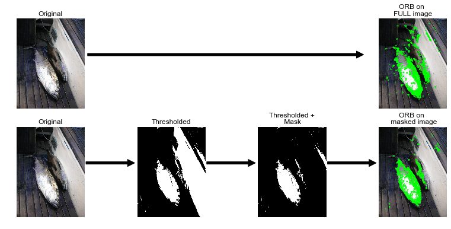
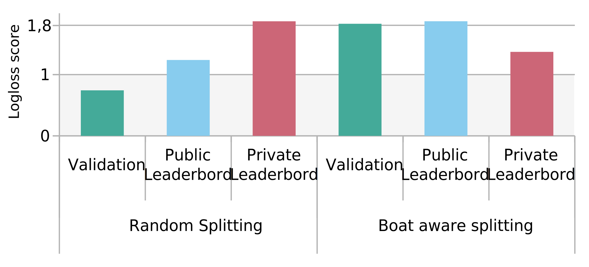
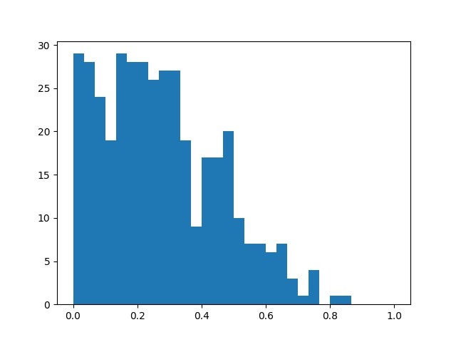

# Article 2

This post is the second part of our experience in the [kaggle
competition](https://www.kaggle.com/c/the-nature-conservancy-fisheries-monitoring).
In our previous post we have described how we start the competition, our first
approaches, the difficulties of the competition, the tools that we used in
terms of project management and organization and some of the main approaches
that you can take into account for a image classification project.  During this
post, we will present the final approaches that we used in the competitions,
the outcomes and the conclusions that we obtained in this experience.

# A more complete bag of features approach

Like many, we noticed that whatever feature detection technique you use, many detection points are for the boat or more globally for the environment that we want to get rid of. In order to limit this issue, we tried to generate a mask to remove large elements such as pieces of boats that are present in the full sized images. The goal for the mask was to remove background elements from the image such as large elements of the boats that are rather squarish and have homogeneous colors and then perform keypoint detection using ORB (very similar results to SURF, that we finally used). We further fine-tuned the idea by adding some gaussian blur and color segmentation to smoothen the shapes as you can see below : 


```python
import cv2
import numpy as np
from matplotlib import pyplot as plt
import matplotlib as mpl

im = 'images/3537255216_d766eac288.jpg'
img = cv2.imread(im)

# Perform keypoint detection on full image
orb = cv2.ORB_create(nfeatures=3000)
kp, descs = orb.detectAndCompute(img, None)
blobs_img_full = cv2.drawKeypoints(img, kp, None, color=(0,255,0), flags=0)

blur = cv2.GaussianBlur(img, (3, 3), 0)
Z = blur.reshape((-1,3))
# convert to np.float32
Z = np.float32(Z)
# define criteria, number of clusters(K) and apply kmeans()
criteria = (cv2.TERM_CRITERIA_EPS + cv2.TERM_CRITERIA_MAX_ITER, 10, 1.0)
K = 16
ret,label,center=cv2.kmeans(Z,K,None,criteria,10,cv2.KMEANS_RANDOM_CENTERS)
# Now convert back into uint8, and make original image
center = np.uint8(center)
res = center[label.flatten()]
res2 = res.reshape((blur.shape))
# Convert to grayscale and apply otsu.
gray = cv2.cvtColor(res2, cv2.COLOR_BGR2GRAY)
ret, thresh = cv2.threshold(gray,0,255,cv2.THRESH_OTSU)

# Noise removal by contour detection of large elements
im2, contours, hierarchy = cv2.findContours(thresh, cv2.RETR_TREE, cv2.CHAIN_APPROX_NONE)
mask = np.zeros(thresh.shape, np.uint8)
mask2 = np.zeros(thresh.shape, np.bool)
# Remove large elements, typically boat structures 
for c in contours:
    # if the contour is not sufficiently large, ignore it
    # this parameter is highly dependant on the image size
    if cv2.contourArea(c) < 20000:
        continue
    cv2.drawContours(mask, [c], -1, (255, 255, 255), -1)
mask2[mask < 250] = True
masked = thresh * mask2
masked = cv2.cvtColor(masked, cv2.COLOR_GRAY2BGR)

# Perform keypoint detection on masked image
orb = cv2.ORB_create(nfeatures=3000)
kp, descs = orb.detectAndCompute(res2 * masked, None)
blobs_img = cv2.drawKeypoints(img, kp, None, color=(0,255,0), flags=0)

# Plot shape of the mask and the detected keypoints
font = {'family' : 'Arial',
        'weight' : 'bold',
        'size'   : 10}
mpl.rc('font', **font)
fig, ax = plt.subplots(2, 4, sharex=False, sharey=False)
fig.set_figwidth(14, forward=True)
fig.set_figheight(6, forward=True)


ax[0, 0].set_aspect(aspect='auto', adjustable='box-forced')
ax[0, 0].set_title('Original')
ax[0, 0].axis('off')
ax[0, 0].imshow(img)

ax[0, 3].set_aspect(aspect='auto', adjustable='box-forced')
ax[0, 3].set_title('ORB on \nFULL image')
ax[0, 3].axis('off')
ax[0, 3].annotate('', xy=(0, 200), xytext=(-1700, 200),
            arrowprops=dict(facecolor='black', shrink=0.05),
            )
ax[0, 3].imshow(blobs_img_full)

ax[0, 1].axis('off')
ax[0, 2].axis('off')

ax[1, 0].set_aspect(aspect='auto', adjustable='box-forced')
ax[1, 0].set_title('Original')
ax[1, 0].axis('off')
ax[1, 0].imshow(img)

ax[1, 1].set_aspect(aspect='auto', adjustable='box-forced')
ax[1, 1].set_title('Thresholded')
ax[1, 1].axis('off')
ax[1, 1].annotate('', xy=(0, 200), xytext=(-300, 200),
            arrowprops=dict(facecolor='black', shrink=0.05),
            )
ax[1, 1].imshow(thresh, cmap=plt.cm.gray)

ax[1, 2].set_aspect(aspect='auto', adjustable='box-forced')
ax[1, 2].set_title('Thresholded +\n Mask')
ax[1, 2].axis('off')
ax[1, 2].annotate('', xy=(0, 200), xytext=(-300, 200),
            arrowprops=dict(facecolor='black', shrink=0.05),
            )
ax[1, 2].imshow(masked, cmap=plt.cm.gray)

ax[1, 3].set_aspect(aspect='auto', adjustable='box-forced')
ax[1, 3].set_title('ORB on \n masked image')
ax[1, 3].axis('off')
ax[1, 3].annotate('', xy=(0, 200), xytext=(-300, 200),
            arrowprops=dict(facecolor='black', shrink=0.05),
            )
ax[1, 3].imshow(blobs_img)

plt.show()
```



As you can see on the images, it does enable us to remove regions for keypoint detection that surround the fishes, such as the floor or the elements in the top-middle region. This is just one example that is not in the dataset (see NDA), but on the images of the dataset, by playing with the number of colours and size of the elements we were actually able to remove quite a lot of non interesting features. At the same time, you can notice that some of the major elements are also lost such as the fins. They are extremely important in fish classification as their positions, proportions to each other and colours are key to fish species definition as previously discussed.

The Kernix Lab has been successful by using [XGBoost](https://xgboost.readthedocs.io/en/latest/) library for classifications problems, which is a popular gradient boosted machine. So we went on to replace random forest by an optimized xgboost classifier and here are the results we had at the end of the competition :

```python
SVG(filename='images/scores_xgboost.svg')
```




Logloss score keep rising from validation dataset to the private one when we used random splitting, showing that it was a final poor choice as the private dataset contained many unseen boats so far. Training with a boat-aware splitting, allowed us to have a much more consistent results between the datasets. Even if the results in terms of rank on the leaderboard were not great with this approach, it showed us that this kind of model, even if less accurate than state-of-the-art classifier, they generalize well compared to many and gives consistent results.


# Strength of deep learning

## Bounding box regression

A kaggle participant posted the coordinates of the bounding box in the [kaggle
forum](https://www.kaggle.com/c/the-nature-conservancy-fisheries-monitoring/discussion/25902)
using the [Sloth](https://github.com/cvhciKIT/sloth). The result contains
information about the `x`, `y`, `width` and `height` of the bounding box for
every fish in the pictures. Taking into acount that some pictures contains
multiple fishes, we tried different approaches like taking only one bounding
box per picture, or a combination of the coordinates of the bounding box for
each picture to include the maximum number of fishes inside the picture. For
instance in the following snippet, we read the different annotations for each
class and each picture and then we take the largest annotation using the
`height` and `width`. 

```python
anno_classes = glob.glob(op.join(self.f.data_external_annos, '*.json'))
bb_json = {}
for fish_class in anno_classes:
    fish_bb_json = json.load(open(op.join(fish_class), 'r'))
    for fish_annotation in fish_bb_json:
        if len(fish_annotation['annotations']) > 0:
        bb_json[fish_annotation['filename'].split('/')[-1]] = sorted(
            fish_annotation['annotations'], key=lambda x:
            x['height']*x['width'])[-1]
```

The pictures that does not contain bounding boxes are filled with empty boundy
box coordinates.

```python
# Get python raw filenames
raw_filenames = [f.split('/')[-1] for f in filenames]

# Image that have no annotation, empty bounding box
empty_bbox = {'x_0': 0., 'y_0': 0., 'x_1': 0., 'y_1': 0.}

for f in raw_filenames:
if not f in bb_json.keys(): bb_json[f] = empty_bbox
```

Keras provides a function
[ImageDataGenerator](https://keras.io/preprocessing/image/) which can be used
as a preprocessing tool to modify or normalize the pictures with predefined
treatment like rescale, rotation, shift, shear, flip, whitening, etc. The
preprocessing generator can read the images directly from a directory path
using the function `flow_from_directory`. The result can be used as an iterator
with and infinite loop that generates images in batches. 

```python
# Image preprocessing generator
train_datagen = image.ImageDataGenerator(rescale=1./255,)

trn_generator = train_datagen.flow_from_directory(
        PATH + 'train',
        target_size=(img_height, img_width),
        batch_size=batch_size,
        shuffle=False,
        class_mode=None,
        seed=seed)
```

Keras provides a method to train images by batches to reduce memory utilization
which is particularly useful when training with GPU with low memory. This also
makes image preprocessing to be done in parallel of training process, which
optimize CPU utilization.  In order to use Keras `fit_generator`, the bounding
box coordinates and the Fish/NoFish label must be transformed also as an
iterator.  The concatenation of the batch image generator, the bounding box
coordinates generator and the Fish/NoFish label results in a global generator
in batch `train_generator` that can be used to feed the training function using
the `fit_generator` method.


```python
# Boundary boxes dict to np.array 
trn_bbox = np.stack([convert_bb(bb_json[f], s) for f, s in
                     zip(raw_filenames, sizes)],).astype(np.float32)
#=> [['x_0', 'y_0', 'x_1', 'x_0'], ['x_0', 'y_0', 'x_1', 'x_0'],...]

# Fish = 1, NoFish = 0,  (NoFish category label == 4)
trn_fish_labels = np.asarray([ 0 if ( fish == 4 ) else 1 for fish in trn_generator.classes ])
#=> [[1], [1], [0],...]

# Transform np arrays to iteratior
def batch(iterable1, iterable2, n=1):
    l1 = len(iterable1)
    l2 = len(iterable2)
    for ndx in range(0, l2, n):
        yield [iterable1[ndx:min(ndx + n, l1)], iterable2[ndx:min(ndx + n, l2)]]

trn_bbox_generator = (n for n in itertools.cycle(batch(trn_bbox, trn_fish_labels,
                                                       n=batch_size)))
# Concatenation of image and labels iterator
train_generator = itertools.izip(trn_generator, trn_bbox_generator)

# Train model
model.fit_generator(train_generator,
                    samples_per_epoch=nbr_train_samples,
                    nb_epoch=nbr_epoch,
                    validation_data=validation_generator,
                    nb_val_samples=nbr_val_samples,
                    callbacks=callbacks_list)
```

## Fine tunned model

We fine-tuned a convent model with different pretrained architectures like [VGG16](http://www.robots.ox.ac.uk/~vgg/research/very_deep/), [InceptionV3](http:/://arxiv.org/abs/1512.00567), [ResNet50](https://arxiv.org/abs/1611.05431).

A pretrained network can determine universal features like curves and edges in
its early layers, those are relevant and useful to most of the classification
problems.
These pretrained models are composed by complex architecture with huge amount
of parametres, trained on large datasets like the [ImageNet](http://www.image-net.org/challenges/LSVRC/), with 1.2M labelled images. 
The most common practice is to truncate the last layer of the pretrained
network and replace it with a new softmax layer with the number of class
desirable for the new problem.

The last layer of the model is **fine tuned** to obtain a fish and no fish classification `x_fish` and also the coordinates of the identified fish `x_fish`. 
[Keras](http://https://github.com/fchollet/keras) contains deep learning models alongside with the pretrained with pre-trained weights. In the snipped below, we load InceptionV3 model with the pre-trainedweights on [ImageNet](http://www.image-net.org/challenges/LSVRC/). Inception V3 has been trained with `299x299x3` images, which is the default parameter but it is posible to modify the size with the parameter `input_shape`. The fine tunning is done removing the top layers (AveragePooling2D, Flatten and Dense) and replacing them by dense layers with the size of the desired classification. The parameters of the top layers replaced remains the same as the initial inception model. Like the [Standfor Convolutional Neural networks document](http://cs231n.github.io/convolutional-networks/) says:

>  "don’t be a hero": Instead of rolling your own architecture for a problem, you should look at whatever architecture currently works best on ImageNet

```python
base_model = InceptionV3(include_top=False, weights='imagenet',
                         input_tensor=None, input_shape=(img_height, img_width, 3))
output = base_model.get_layer(index=-1).output  # Shape: (8, 8, 2048)
output = AveragePooling2D((8, 8), strides=(8, 8),
                          name='avg_pool')(output)
output = Flatten(name='flatten')(output)
x_bb = Dense(4, name='bb')(output)
x_fish = Dense(1, activation='sigmoid', name='fish')(output)
model = Model(base_model.input, [x_bb, x_fish])
```

We obtained better results with the inception network proposed from the keras function.
Inception network is built from convolutional building blocks. This
architecture is especially useful in the context of localization and object
detection.
There has been different version of Inception `v1`, `v2`, `v3`. The version `Inception v3` is a variant of the [GoogleNet network](https://arxiv.org/pdf/1409.4842v1.pdf) with the implementation of _batch normalization_. This refers to an additional normalization of the fully connected layer of the auxiliar classifier and not only the convolution blocks. 

--- 

## Cropping results

In order to evaluate the results of the model we use the intersection over union. This approach give us an approach ...



# Conclusion & perspective

- Clipping to reduce the penalization from log loss score
- Winning solution include state of the art algorithms like [SSD](https://github.com/rykov8/ssd_keras)
