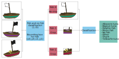
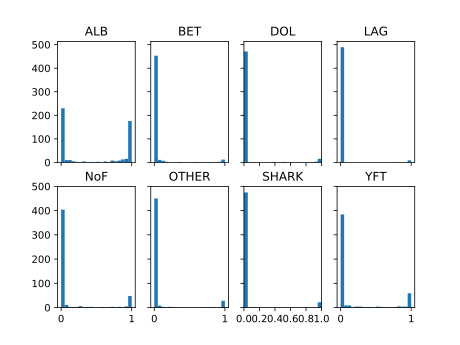

# Article 2

This post is the second part of our experience in the [kaggle
competition](https://www.kaggle.com/c/the-nature-conservancy-fisheries-monitoring).
In our previous post we have described how we start the competition, the
computer vision approach that we used, as well as the tools in
terms of project management and organization that we used along the competition.
During this post, we will present the details about a deep learning approach,
the outcome and the conclusions that we obtained in this experience.

# Strength of deep learning

In order to improve the results of a classification algorithm, we decided to
reduce the noise of the pictures using an object detection method.  
We got inspired from similar [previous kaggle
competitions](https://deepsense.io/deep-learning-right-whale-recognition-kaggle/),
where the purpose was to recognize individual whales.
We decided to implement a similar algorithm and obtain the coordinates of
the bounding box containing a fish. 
An schema of the approach is shown in the figure below.
We decided to do this by training a CNN model inspired by the [deep learning
courses of
fast.io](https://github.com/fastai/courses/blob/master/deeplearning1/nbs/lesson7.ipynb).
This is a good starting place to learn deep learning and apply it for this competition.
Our model was adapted to additionally obtain a classification of the picture to know if it contains a fish or not. 
Depending if the model predicts a fish in the image, it is crop or not.



## Bounding box regression

A kaggle participant posted in the [kaggle
forum](https://www.kaggle.com/c/the-nature-conservancy-fisheries-monitoring/discussion/25902)
the coordinates of the bounding box for every fish in the pictures of the train
set. This has been made using the labelling software
[Sloth](https://github.com/cvhciKIT/sloth). The posted files contain
information of the coordinates of the bounding box in terms of the starting
point and the size of the box (`x`, `y`, `width` and `height`).  Taking into
account that some pictures contain multiple fishes, we tried different
approaches like taking only one bounding box per picture, or a combination of
the coordinates of the bounding box for each picture to include the maximum
number of fishes inside the picture but the results were very similar. For
instance in the following snippet, we read the different annotations for each
class and each picture and then we take the coordinates for the bigger fish in
the `height` and `width`. 

```python
anno_classes = glob.glob(op.join(self.f.data_external_annos, '*.json'))
bb_json = {}
for fish_class in anno_classes:
    fish_bb_json = json.load(open(op.join(fish_class), 'r'))
    for fish_annotation in fish_bb_json:
        if len(fish_annotation['annotations']) > 0:
        bb_json[fish_annotation['filename'].split('/')[-1]] = sorted(
            fish_annotation['annotations'], key=lambda x:
            x['height']*x['width'])[-1]
```

The pictures that does not contain bounding boxes are filled with empty box coordinates.

```python
# Get python raw filenames
raw_filenames = [f.split('/')[-1] for f in filenames]

# Image that have no annotation, empty bounding box
empty_bbox = {'x_0': 0., 'y_0': 0., 'x_1': 0., 'y_1': 0.}

for f in raw_filenames:
if not f in bb_json.keys(): bb_json[f] = empty_bbox
```

Keras provides a function
[ImageDataGenerator](https://keras.io/preprocessing/image/) which can be used
as a preprocessing tool to modify or normalize the pictures with predefined
treatment like rescale, rotation, shift, shear, flip, whitening, etc. The
preprocessing generator can read the images directly from a directory path
using the function `flow_from_directory`. The result is an iterator with
generates images in batches in an  infinite loop.

```python
# Image preprocessing generator
train_datagen = image.ImageDataGenerator(rescale=1./255,)

trn_generator = train_datagen.flow_from_directory(
        PATH + 'train',
        target_size=(img_height, img_width),
        batch_size=batch_size,
        shuffle=False,
        class_mode=None,
        seed=seed)
```

Keras also provides a method to train images by batches using a generator. This
reduces memory utilization which is particularly useful when training with a
GPU with low memory. 
In addition, it optimize CPU utilization because image preprocessing is done in
parallel of training process.
For our case, in order to use Keras `fit_generator` function, the bounding
box coordinates and the Fish/NoFish label must be transformed to an
iterator. 
We used the [`itertool`](https://docs.python.org/2/library/itertools.html)
library provides useful functions to concatenate iterators and also to make an
iterator cyclic.
As a result, the iterator used to feed the training function contains the concatenation of
the image generator, the bounding box
coordinates generator and the Fish/NoFish label generator. 
This iterator is called `train_generator` and send batches of values to the
`fit_generator` function.
This block has been done as follows:


```python
# Boundary boxes dict to np.array 
trn_bbox = np.stack([convert_bb(bb_json[f], s) for f, s in
                     zip(raw_filenames, sizes)],).astype(np.float32)
#=> [['x_0', 'y_0', 'x_1', 'x_0'], ['x_0', 'y_0', 'x_1', 'x_0'],...]

# Fish = 1, NoFish = 0,  (NoFish category label == 4)
trn_fish_labels = np.asarray([ 0 if ( fish == 4 ) else 1 for fish in trn_generator.classes ])
#=> [[1], [1], [0],...]

# Transform np arrays to iteratior
def batch(iterable1, iterable2, n=1):
    l1 = len(iterable1)
    l2 = len(iterable2)
    for ndx in range(0, l2, n):
        yield [iterable1[ndx:min(ndx + n, l1)], iterable2[ndx:min(ndx + n, l2)]]

trn_bbox_generator = (n for n in itertools.cycle(batch(trn_bbox, trn_fish_labels,
                                                       n=batch_size)))
# Concatenation of image and labels iterator
train_generator = itertools.izip(trn_generator, trn_bbox_generator)
```

## Fine tuned model

We fine-tuned a convent model using the
[InceptionV3](http:/://arxiv.org/abs/1512.00567) pretrained architecture.
Fine-tuning a model consists to replace last layer it with a new softmax layer
with the number of class wanted to use for the classification problem.  The
advantages of using a pretrained network is that it can determine universal
features like curves and edges in its early layers, which is relevant for most
of the classification problems.
These pretrained models are composed by complex architecture with huge amount
of parameters, trained on large datasets like the [ImageNet](http://www.image-net.org/challenges/LSVRC/), with 1.2M labelled images. 
Fine-tuning is a common practice for classification problems that are related
with the previous application of the model in the
[ImageNet](http://www.image-net.org/challenges/LSVRC/) competition.


For our case, the last layer of the model is **fine tuned** to obtain a fish
and no fish classification `x_fish` and also the coordinates of the identified
fish `x_fish`.  [Keras](http://https://github.com/fchollet/keras) contains deep
learning models alongside with the pretrained with pre-trained weights such as
[ResNet50](https://arxiv.org/abs/1611.05431),
[VGG16](http://www.robots.ox.ac.uk/~vgg/research/very_deep/) and
[InceptionV3](http:/://arxiv.org/abs/1512.00567).  In the snipped below, we
load InceptionV3 model with the pre-trained weights on
[ImageNet](http://www.image-net.org/challenges/LSVRC/). Inception V3 has been
trained with `299x299x3` images, which is the default parameter but it is
possible to modify the size with the parameter `input_shape`. The fine-tuning
is done by removing the top layers (AveragePooling2D, Flatten and Dense) and
replacing them by dense layers with the size of the desired classification. The
parameters of the top layers replaced remains the same as the initial inception
model. Like the [Standfor Convolutional Neural networks
document](http://cs231n.github.io/convolutional-networks/) says:

>  "don’t be a hero": Instead of rolling your own architecture for a problem, you should look at whatever architecture currently works best on ImageNet

```python
base_model = InceptionV3(include_top=False, weights='imagenet',
                         input_tensor=None, input_shape=(img_height, img_width, 3))
output = base_model.get_layer(index=-1).output  # Shape: (8, 8, 2048)
output = AveragePooling2D((8, 8), strides=(8, 8),
                          name='avg_pool')(output)
output = Flatten(name='flatten')(output)
x_bb = Dense(4, name='bb')(output)
x_fish = Dense(1, activation='sigmoid', name='fish')(output)
model = Model(base_model.input, [x_bb, x_fish])
```

The loss function used to train the model is a [mean square
error](https://en.wikipedia.org/wiki/Mean_squared_error) in case of the
bounding box regression and `binary crossentropy` for the fish/nofish
classification.
We use the [stochastic gradient descent
optimizer](https://keras.io/optimizers/#sgd) to train our model and an
initialization using momentum and a [nesterov
scheme](http://www.cs.toronto.edu/~fritz/absps/momentum.pdf) to accelerate
convergence. 
Finaly, we train the model using the `train_generator` which delivers the 
images, the bounding box and the fish labels by batches. 
The batch size depends on the memory of the GPU, the size of the image and the
size of the neural network used to train the model. For example using
`InceptionV3`, image size of `640x360` and a [GPU
Titan](http://www.geforce.com/hardware/desktop-gpus/geforce-gtx-titan/specifications)
with 6Gb, the batch size can be 16.
We separate the train set in two to obtain a validation set, we create a
generator to obtain the validation images, bounding box and fish labels by
batches the same way as we did for `train_generator`.

```python
optimizer = SGD(lr=learning_rate, momentum=0.9, decay=0.0,
                nesterov=True)
model.compile(loss=['mse', 'binary_crossentropy'],
              optimizer=optimizer, metrics=['accuracy'],
              loss_weights=[0.001, 1.])

# Train model
model.fit_generator(train_generator,
                    samples_per_epoch=nbr_train_samples,
                    nb_epoch=nbr_epoch,
                    validation_data=validation_generator,
                    nb_val_samples=nbr_val_samples,
                    callbacks=callbacks_list)
```

We obtained better results with the inception network proposed from the keras function.
Inception network is built from convolutional building blocks. This
architecture is especially useful in the context of localization and object
detection.
There has been different version of Inception `v1`, `v2`, `v3`. The version `Inception v3` is a variant of the [GoogleNet network](https://arxiv.org/pdf/1409.4842v1.pdf) with the implementation of _batch normalization_. This refers to an additional normalization of the fully connected layer of the auxiliary classifier and not only the convolution blocks. 

## Cropping results

The model is trained to decrease the absolute distance between the
predicted coordinates and the existing ones, but a more common metric to measure 
object detection techniques is the [intersection over
union](http://www.pyimagesearch.com/2016/11/07/intersection-over-union-iou-for-object-detection/).
Basically it is the ratio of the common and the total area of the predicted and the ground truth bounding box.
The obtained results that are not completely satisfactory because the predicted bounding boxes
does not intersect always the bounding box used for validation. This occurs because
some pictures contains several fishes, then the model hardly generalize to
predict the bounding box used for validation. 
In addition, we must keep in mind that the pictures of the test set are really
different from the pictures of the train set because it contains completely
different boats, so it complicates the regression task.


# Using neural networks to make fish classification

Similar to the regression model used to obtain the coordinates of the bounding
box, the classification can be obtained by fine tuning the last layer of
the pretrained model to obtain the classification of the fish. 
The only thing that changes is the last layer `x_class` with 8 different outputs:

```python
base_model = InceptionV3(include_top=False, weights='imagenet',
                         input_tensor=None, input_shape=(img_height, img_width, 3))
output = base_model.get_layer(index=-1).output  # Shape: (8, 8, 2048)
output = AveragePooling2D((8, 8), strides=(8, 8),
                          name='avg_pool')(output)
output = Flatten(name='flatten')(output)
x_class = Dense(8, name='class')(output)
model = Model(base_model.input, x_class)
```

The results are highly affected by the way we split the train set, as we
seen in the [article 1](REF). Using a random split we obtain a validation log loss
of 0.4 and 1.02 for the submission test in the public leader board. 
This shows that the model overfits over the training set.
Using a split with different boats in the train and validation set, we obtain a
log loss of 0.98 and 1.3 in the public leader board. 
This split allows us to obtain an estimation of what would be the score on the
public leader board without making a submission on the kaggle platform.
However, the predictions of this model in the public leader board are worse
than the one used a random split because the trained model see less boats than
the random split.

-              | -   | Random split | -       | -    | Boat split | -
---            | --- | ---          | ---     | ---  | ---        | ---
-              | Val | Public       | Private | Val  | Public     | Private
Raw images     | 0.4 | **1.02**⭐️   | 2.66    | 0.98 | 1.3        | 2.65
Cropped images | 0.2 | -            | -       | 0.96 | 1.41       | 3.01

## Different boat split

The log loss and the accuracy obtained while training the model is not enough
to evaluate the performance of the model, specially in a multi categorical and
unbalanced problem like this. This is why we use [confusion
matrix](https://en.wikipedia.org/wiki/Confusion_matrix) to see the number of
right and wrong predicted photos for each class. As shown below, we can see
that the model does not predict correctly the non representative classes like
the big eyed tuna (BET), the moonfish (LAG) or the other class. 


In addition we calculate the probability distribution for each class to see if
the model is confident of the predictions that it made for each class. The
model is more confident for the predictions of the albacore (ALB), yellow fish
tuna (YFT) and a few sharks (SHK).


## Random split

Using a random split the model see more boat pictures but since some pictures
of each boat are very similar (video sequences) the validation log loss becomes
very optimistic because it validates with photos very similar to the ones seen
during the training.  In consequence, the predictions seems very accurate as
show in the following confusion matrix.


In addition the model is more confident of the predictions made. As can be seen for classes like shark (SHK), 




# Conclusion & perspective

During a personal point of view, during  this competition we learned how to
work efficiently as a team for Data sience project. We used organizational
tools like
[cookiecutter](http://drivendata.github.io/cookiecutter-data-science/) and
other tools such as a [python virtual
environement](http://docs.python-guide.org/en/latest/dev/virtualenvs/) to keep
trace of the used packages.

We tasted the two main approaches for image classification, such as traditional
computer vision and deep learning approaches.
Even if the deep learning approach seems to be conquest the image
classificaiton problems, the traditional computer vision approaches are also a
robust and good generalization alternative.

- Specificities of the dataset : boat splitting, tiny differences between species...
- Clipping to reduce the penalization from log loss score
