# 1. The competition and the data

## <font color="white">Starting point </font> {data-background="https://media.giphy.com/media/WfNIOjdnCh212/giphy.gif?response_id=591d519f2c191af3c3ffbedd"}

<font color="white">In the Western and Central Pacific, 60% of the world’s tuna is caught illegally, a threat to marine ecosystem.</font> 

## Goal of the competition 

Automate fish detection on pictures from fishing boats.
(with machine learning)

<video controls="controls" poster="https://kaggle2.blob.core.windows.net/competitions/kaggle/5568/media/TNC-poster-640x360.png" width="640" height="360">
  <source src="https://kaggle2.blob.core.windows.net/competitions/kaggle/5568/media/TNC.mp4" type="video/mp4">
Your browser does not support the video tag.
</video>

## Images classes 

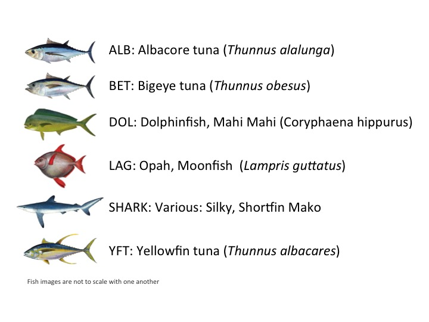{class=plain}

## Data

Name         | Number of photos
---          | ---
Train        | 3777
Test stage 1 | 1000
Test stage 2 | 12000

## Class distribution

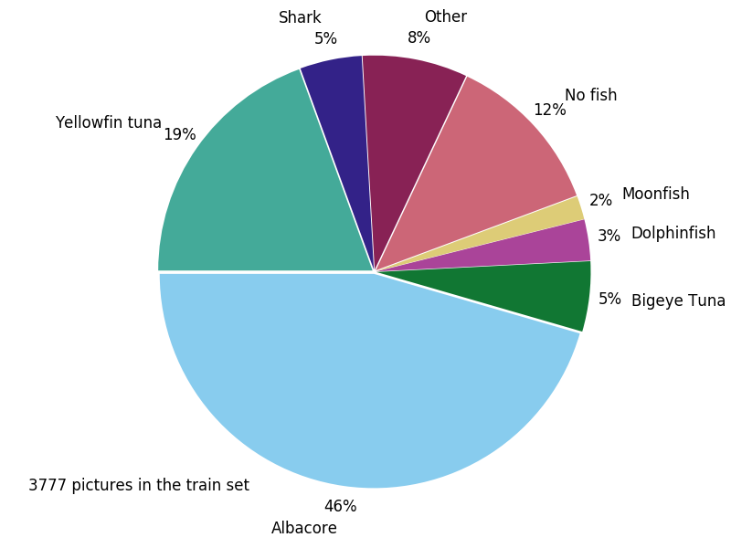{width=50% class=plain}

## Image sizes

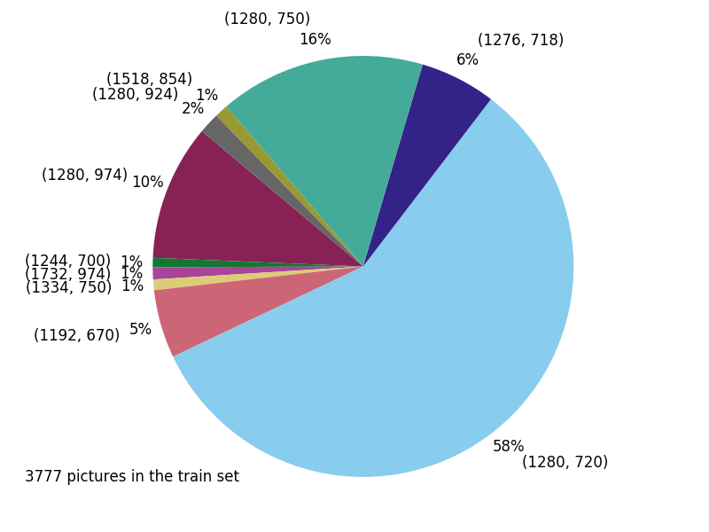{width=50% class=plain}

## Preliminary observations

* Pictures from video sequences
* Limited number of boats in training set
* Day/night pictures
* Multiple fishes per picture
* Train set labelling errors

## Important dates

Stage             | Date
---               | ---
Competition start | 14 Nov 2016
We start 🎉       | 13 Jan  2017
End stage 1       | 6 April 2017
End stage 2       | 13 April 2017

# 2. Computer vision based approach

## Extract features

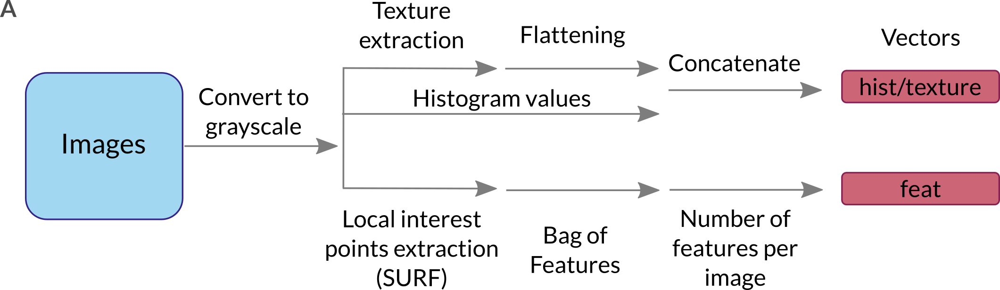{class=plain}

## Combine features and train a model

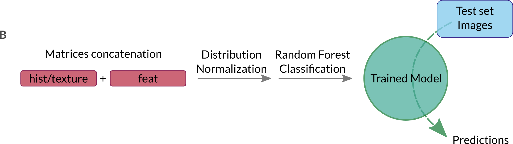{class=plain}

## Analyze the results

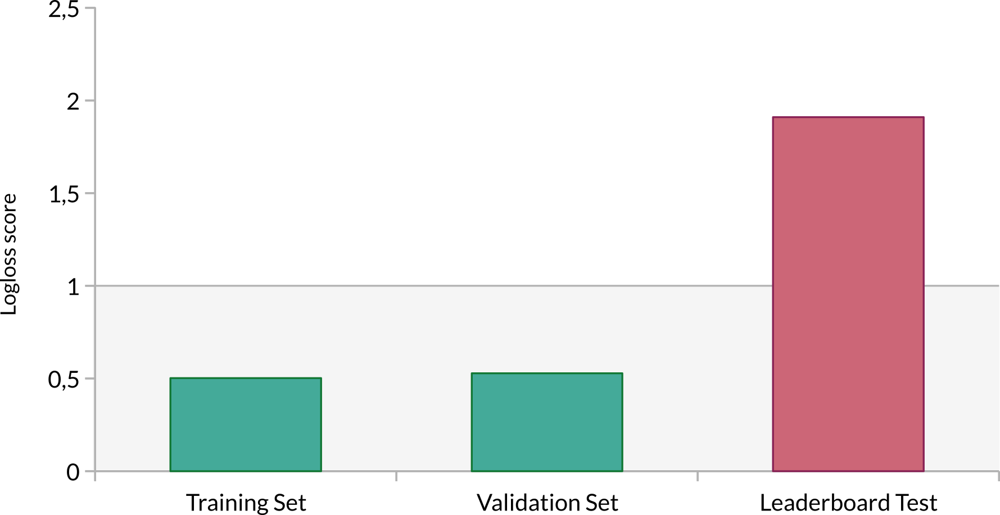{class=plain}

## Remove background information

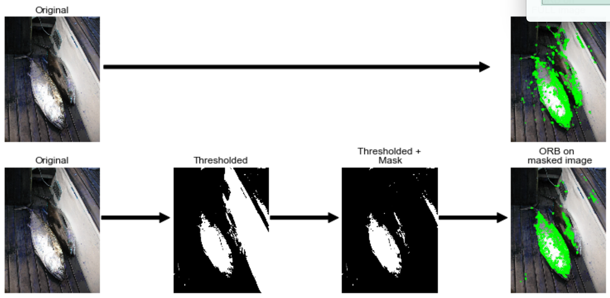{width=70% class=plain}

## Take into account the cameras

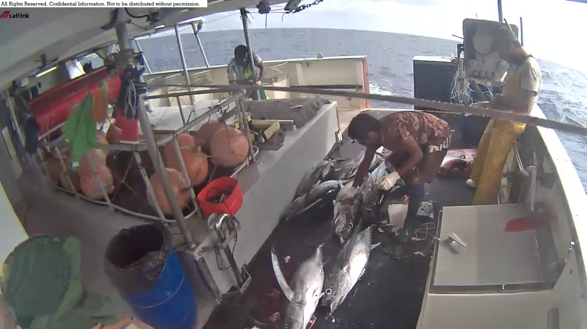{width=30% class=plain}
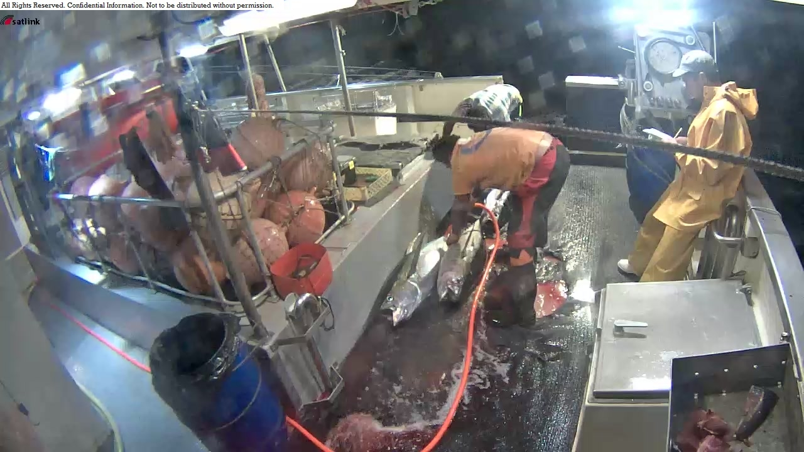{width=30% class=plain}
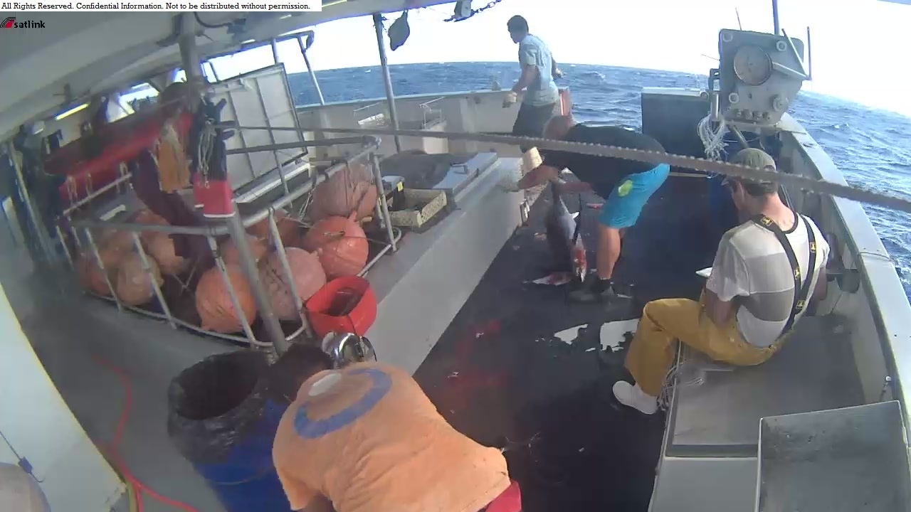{width=30% class=plain}

Developped a Custom splitting


## Final scoring

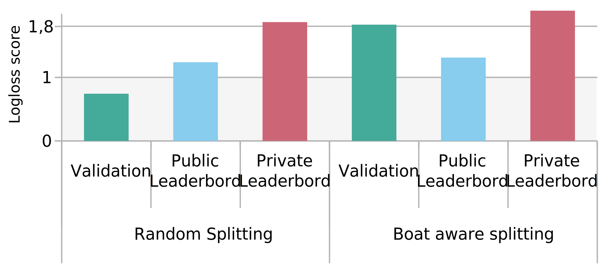{width=71% class=plain}

* Difficult to engineer the features
* Model robust for prediction on new data
* Top 1, private leaderboard : 1.06

# 3. A methodological break

## Cookiecutter

```txt
├── LICENSE
├── Makefile           <- Makefile with commands like 'make data' or 'make train'
├── README.md          <- The top-level README for developers using this project.
├── data
│   ├── external       <- Data from third party sources.
│   ├── interim        <- Intermediate data that has been transformed.
│   ├── processed      <- The final, canonical data sets for modeling.
│   └── raw            <- The original, immutable data dump.
│
├── docs               <- A default Sphinx project; see sphinx-doc.org for details
│
├── models             <- Trained and serialized models, model predictions, or model summaries
│
├── notebooks          <- Jupyter notebooks. Naming convention is a number (for ordering),
│                         the creator s initials, and a short '-' delimited description, e.g.
│                         '1.0-jqp-initial-data-exploration'.
│
├── references         <- Data dictionaries, manuals, and all other explanatory materials.
│
├── reports            <- Generated analysis as HTML, PDF, LaTeX, etc.
│   └── figures        <- Generated graphics and figures to be used in reporting
│
├── requirements.txt   <- The requirements file for reproducing the analysis environment, e.g.
│                         generated with 'pip freeze > requirements.txt'
│
├── src                <- Source code for use in this project.
│   ├── __init__.py    <- Makes src a Python module
│   │
│   ├── data           <- Scripts to download or generate data
│   │   └── make_dataset.py
│   │
│   ├── features       <- Scripts to turn raw data into features for modeling
│   │   └── build_features.py
│   │
│   ├── models         <- Scripts to train models and then use trained models to make
│   │   │                 predictions
│   │   ├── predict_model.py
│   │   └── train_model.py
│   │
│   └── visualization  <- Scripts to create exploratory and results oriented visualizations
│       └── visualize.py
│
└── tox.ini            <- tox file with settings for running tox; see tox.testrun.org

```

Note : Cookiecutter is based on jinja2...

[Source](https://drivendata.github.io/cookiecutter-data-science/)

## Data abstraction layer

```python
class ProjFolder(objdict):
    """
    A class to define project's subfolders for easy access.
    """
    def __init__(self):
        # level data
        self.datafolder = op.join(ROOTFOLDER, 'data')
        for subfol in ['external', 'interim', 'processed', 'raw']:
            setattr(self,
                    'data_' + subfol,
                    op.join(self.datafolder, subfol))

        # level data external
        for subfol in ['annos', 'rotate_crop']:
            setattr(self,
                    'data_external_' + subfol,
                    op.join(self.data_external, subfol))

        # level data interim
        for subfol in ['train', 'test']:
            setattr(self,
                    'data_interim_' + subfol,
                    op.join(self.data_interim, subfol))

        for subfol in ['crop', 'generated', 'rotatecrop', 'raw']:
            setattr(self,
                    'data_interim_train_' + subfol,
                    op.join(self.data_interim_train, subfol))

        for subfol in ['train', 'val']:
            setattr(self,
                    'data_interim_train_crop_' + subfol,
                    op.join(self.data_interim_train_crop, subfol))

        for subfol in ['train', 'val']:
            setattr(self,
                    'data_interim_train_rotatecrop_' + subfol,
                    op.join(self.data_interim_train_rotatecrop, subfol))

        # level data processed
        # for subfol in []:
        #     setattr(self,
        #             'data_processed_' + subfol,
        #             op.join(self.data_processed, subfol))

        # level data raw
        for subfol in ['train', 'test', 'test2']:
            setattr(self,
                    'data_raw_' + subfol,
                    op.join(self.data_raw, subfol))

    def make_folder(self):
        for directory in self.values():
            if not op.exists(directory):
                os.makedirs(directory)

```

## Data abstraction layer II

Every image had properties saved into json:

* name
* image name
* path to raw
* path to cropped
* fish type
* ...

## Advantages

* Stimulates **clear** code file structure
* Speed to get folder structure
* Pythonic, object oriented
* Fast to expand analysis

## The break is over ;)

# 4. Deep learning approach

## Bounding box regression

* Fishes Bounding box coordinates shared on [kaggle forum](https://www.kaggle.com/c/the-nature-conservancy-fisheries-monitoring/discussion/25902).
* Done using [Sloth](https://github.com/cvhciKIT/sloth).
* Coordinates of the bounding box referenced as (`x`, `y`, `width` and `height`).

## Multiple fish per picture

* Only one bounding box per picture,
* Data augmentation by selecting multiple fishes per pictures
* No Fish : empty coordinates.

## Image preprocessing with keras

* Preprocessing with Keras ([ImageDataGenerator](https://keras.io/preprocessing/image/))
    * Rescale, rotation, shift, shear, flip, whitening, etc.

* Preprocessing generator `flow_from_directory`:
    * Read images form a directory.
    * Assign class for each subdirectory
    * Generates batches of augmented/normalized data 
    * Yields batches indefinitely, in an infinite loop.


## Training

* Keras also provides a method to train images by batches (`fit_generator`)
    * reduce memory utilization.
    * image preprocessing to be done in parallel of training process
* Requirement: bounding box coordinates and the Fish/NoFish label must be
   transformed as an iterator.  


---

### Train the model by batch

* The generator that feed the training fonction by batch contains:
    * The image generator
    * The bounding box coordinates generator
    * The Fish/NoFish label

* itertools: [cylce](https://docs.python.org/2/library/itertools.html#itertools.cycle), [izip](https://docs.python.org/2/library/itertools.html#itertools.izip)

```python
>>> itertools.cycle('ABCD')
A B C D A B C D ...`
>>> itertools.izip('ABCD', 'xy')
Ax By`
```

## Pretrained model

* Pretrained network determine universal features (curves and edges in its early layers). 

* Pretrained models 
    * Complex architecture with huge amount of parametres
    * Trained on large datasets like the ImageNet, with 1.2M labelled images. 


## Fine tuning 

* Replace last layer it with a new softmax layer with the number of class
 
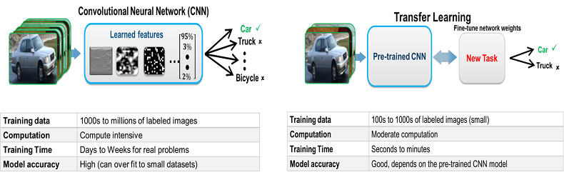

## Image augmentation

* Rescale `[0:255] -> [0.:1.]` 
    * InceptionV3 graph operates on floating point values

* shear

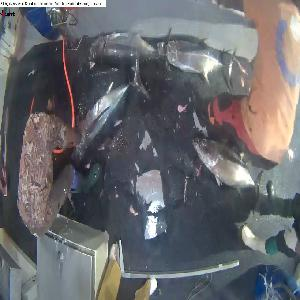
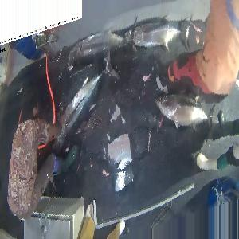

* rotation, shift, shear, flip, whitening, etc.

# 5. Elements of conclusion

-------------

## What we learned

- Working together in an efficient manner
- Getting fair results 'easily'
- Kaggle organizer can mess things up quite a bit (stage 1/2)
- How to work with images and machine learning (computer vision & convnet)
- Specificities of the dataset : boat splitting, tiny differences between species...

## What the best contestants did

- Massive ensembling
- State-of-the-art object detection (FastRCNN, SSD,...)
- Used pretrained models that are hardly available for newcomers (not implemented in current standard libraries)
- Spent more time

## Not sure if it should be kept... or how to organize

- Image preprocessing can significantly increase the performance of a
  classification algorithm.
- A feature descriptor represents a simplified version of an image by
  extracting useful information and throwing away extraneous information.
- Using feature description increases training speed compared with raw images.
